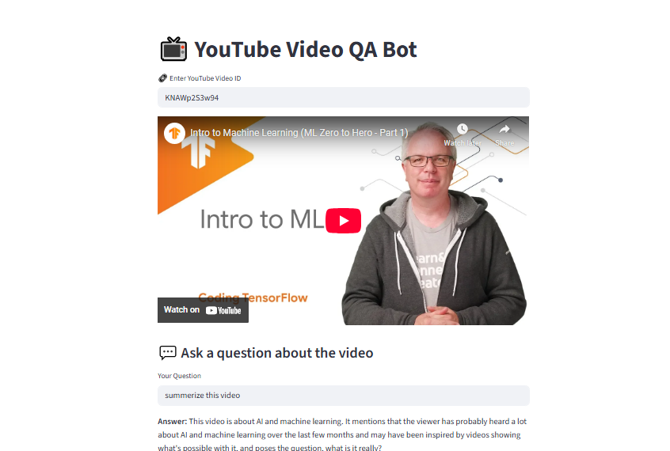

# 📺 YouTube RAG Chatbot

This project is a Retrieval-Augmented Generation (RAG) chatbot for YouTube videos. It allows users to input a YouTube video ID, loads the transcript of the video, builds a vector store of the transcript chunks using embeddings, and enables users to ask questions about the video content. The chatbot answers questions based on the transcript context using Google Generative AI models.

## ✨ Features

- 🔗 Input a YouTube video ID to load the video and its transcript.
- 📜 Automatically fetches the transcript using the YouTube Transcript API.
- ✂️ Splits the transcript into chunks and creates embeddings using Google Generative AI Embeddings.
- 💾 Builds a vector store with Chroma for efficient similarity search.
- 🤖 Uses a retrieval chain with a Google Generative AI language model to answer questions based on the transcript.
- 🌐 Streamlit web interface for easy interaction.

## 🛠️ Requirements

- Python 3.10 or higher (tested with Python 3.12)
- Streamlit
- langchain and related packages
- youtube-transcript-api
- Google Cloud API key with access to Generative AI models

## Installation

1. Clone the repository:

```bash
git clone <repository-url>
cd Youtube-chatbot-(A RAG Based System)
```

2. Create and activate a virtual environment (recommended):

```bash
python -m venv venv
# On Windows
venv\Scripts\activate
# On macOS/Linux
source venv/bin/activate
```

3. Install dependencies:

```bash
pip install -r requirements.txt
```

4. Set your Google API key in `rag_youtube.py`:

```python
GOOGLE_API_KEY = 'your-google-api-key-here'
```

## Usage

Run the Streamlit app:

```bash
streamlit run app.py
```

Open the URL shown in the terminal (usually http://localhost:8501).

Enter a YouTube video ID (e.g., `KNAWp2S3w94`) in the input box.

The app will load the video and its transcript, build the vector store, and allow you to ask questions about the video content.

## Project Structure

- `app.py`: Streamlit app entry point and UI logic.
- `rag_youtube.py`: Core logic for transcript extraction, vector store building, and retrieval chain creation.
- `chromadb/`: Directory where Chroma vector store data is persisted.

## Notes

- The project uses Google Generative AI models via the `langchain_google_genai` package.
- The creation of embeddings and language model instances is done asynchronously to avoid event loop errors.
- The app currently accepts YouTube video IDs directly instead of full URLs.

## Troubleshooting

- If you encounter errors related to event loops or async clients, ensure you are using Python 3.10+ and have the latest versions of dependencies.
- Make sure your Google API key has the necessary permissions for Generative AI services.

## License

This project is provided as-is without warranty. Use at your own risk.

## Acknowledgments

- [LangChain](https://python.langchain.com/)
- [YouTube Transcript API](https://github.com/jdepoix/youtube-transcript-api)
- [Streamlit](https://streamlit.io/)
- Google Generative AI APIs
